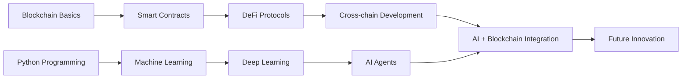

# 👋 Hi, I'm Bodhi (@B0DH1i)

<div align="center">
  
[](https://git.io/typing-svg)

</div>

## 🚀 About Me

I'm a passionate developer exploring the intersection of **Blockchain Technology** and **Artificial Intelligence**. My journey spans across decentralized systems, machine learning, and cutting-edge AI applications.

- 🔗 **Blockchain Enthusiast**: Active testnet node operator and aspiring blockchain developer
- 🤖 **AI/ML Focus**: Specializing in NLP, Computer Vision, and Neural Networks
- 🌱 **Currently Learning**: Advanced smart contract development, DeFi protocols, and transformer architectures
- 💡 **Vision**: Building the future where AI meets decentralized technology
- 📫 **Reach me**: [Telegram - @Boddhii](https://t.me/Boddhii)

## 🛠️ Tech Stack

### Blockchain & Web3
```
🔗 Blockchain Platforms    │ Ethereum, Polygon, Solana, Cosmos
⚡ Smart Contracts        │ Solidity, Rust, Move
🏗️ Development Tools      │ Hardhat, Truffle, Foundry, Anchor
🌐 Web3 Libraries         │ Web3.js, Ethers.js, Wagmi
```

### AI & Machine Learning
```
🧠 Machine Learning       │ TensorFlow, PyTorch, Scikit-learn
🗣️ Natural Language       │ Transformers, BERT, GPT, LangChain
👁️ Computer Vision        │ OpenCV, YOLO, CNN, Image Processing
📊 Data Science           │ Pandas, NumPy, Matplotlib, Seaborn
```

### Development & Infrastructure
```
� Languages              │ Python, JavaScript, TypeScript, Rust, Solidity
🚀 Frameworks             │ React, Next.js, FastAPI, Node.js
🗄️ Databases              │ PostgreSQL, MongoDB, Redis, ChromaDB
☁️ Cloud & DevOps         │ Docker, AWS, GCP, Kubernetes
```

## 🎯 Current Focus Areas

<table>
<tr>
<td width="50%">

### 🔗 Blockchain Development
- **DeFi Protocols**: Building decentralized finance applications
- **NFT Marketplaces**: Creating unique digital asset platforms
- **Cross-chain Solutions**: Developing interoperability protocols
- **Testnet Operations**: Running validator nodes across multiple networks

</td>
<td width="50%">

### 🤖 AI/ML Projects
- **NLP Applications**: Sentiment analysis, text generation, chatbots
- **Computer Vision**: Object detection, image classification, OCR
- **Neural Networks**: Deep learning models for various domains
- **AI Agents**: Building autonomous reasoning systems

</td>
</tr>
</table>

## 📈 GitHub Stats

<div align="center">
  


</div>

## 🏆 Featured Projects

### 🔗 Blockchain Projects
- **DeFi Yield Aggregator** - Multi-protocol yield farming optimizer
- **NFT Minting Platform** - Gas-efficient smart contracts with metadata management
- **Cross-chain Bridge** - Asset transfer protocol between EVM chains
- **DAO Governance** - Decentralized voting and proposal management system

### 🤖 AI/ML Projects
- **ReAct Agent System** - Autonomous reasoning agent with tool integration
- **NLP Sentiment Analyzer** - Real-time social media sentiment tracking
- **Computer Vision Pipeline** - Object detection and classification system
- **Chatbot Framework** - Multi-domain conversational AI platform

## 🌐 Testnet Contributions

<div align="center">

| Network | Role | Status | Contribution |
|---------|------|--------|--------------|
| 🟣 **Ethereum 2.0** | Validator | Active | Beacon chain validation |
| 🔵 **Polygon** | Node Operator | Active | Network security |
| 🟠 **Solana** | RPC Provider | Active | Infrastructure support |
| ⚫ **Cosmos Hub** | Validator | Active | IBC protocol testing |
| 🔴 **Arbitrum** | Sequencer | Testing | L2 scaling solutions |

</div>

## 📚 Learning Journey



## 🎓 Skills & Expertise

<div align="center">

### Programming Languages


### Blockchain & Web3


### AI & Machine Learning


### Development Tools


</div>

## 🤝 Let's Connect & Collaborate

<div align="center">

[](https://t.me/Boddhii)
[](https://github.com/B0DH1i)
[](#)
[](#)

</div>

## 💡 What I'm Working On

- 🔬 **Research**: AI-powered smart contract auditing tools
- 🏗️ **Building**: Cross-chain DeFi protocol with ML-based risk assessment
- 📖 **Learning**: Zero-knowledge proofs and privacy-preserving ML
- 🌱 **Growing**: Open-source contributions to blockchain and AI communities


---

<div align="center">

### 🌟 "Building the decentralized future with artificial intelligence" 🌟

*Always open to collaboration on innovative blockchain and AI projects!*


</div>

---

<!---
B0DH1i/B0DH1i is a ✨ special ✨ repository because its `README.md` (this file) appears on your GitHub profile.
You can click the Preview link to take a look at your changes.
--->
